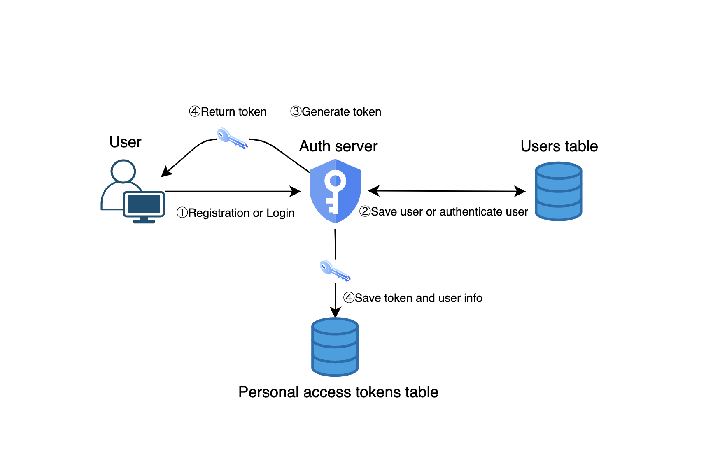
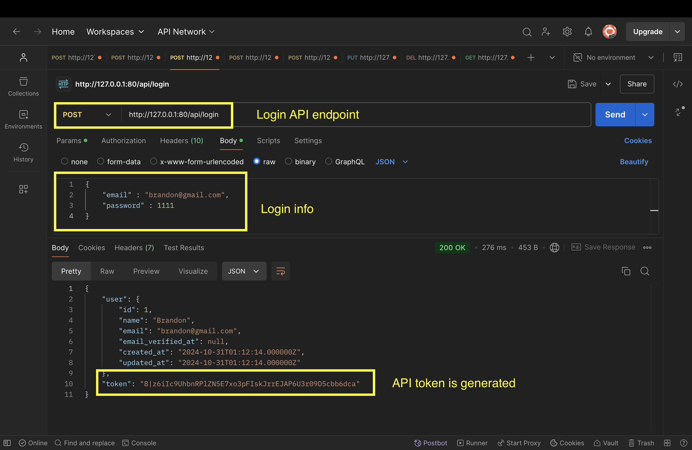
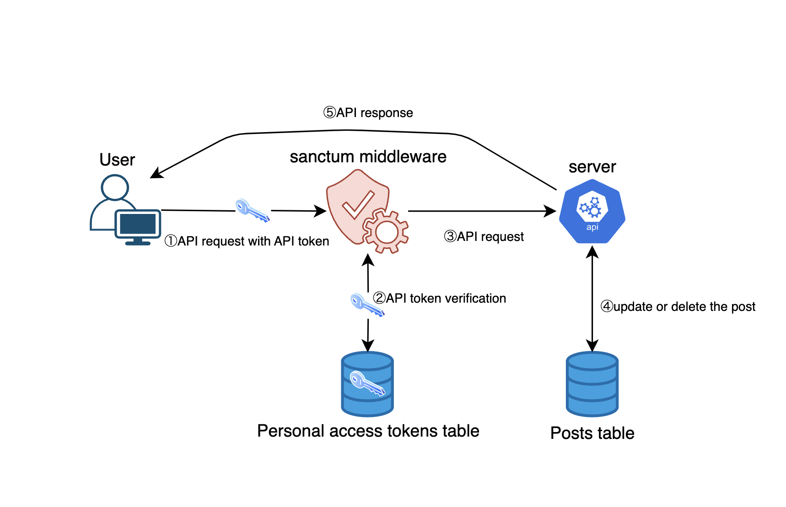
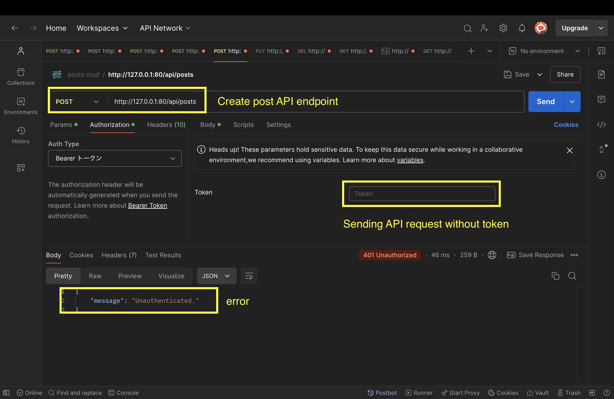
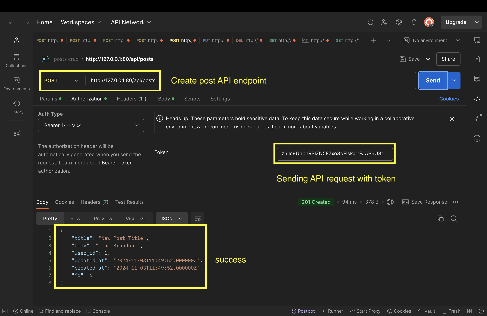
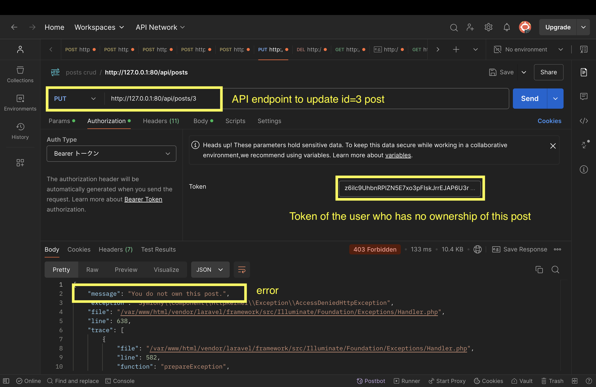
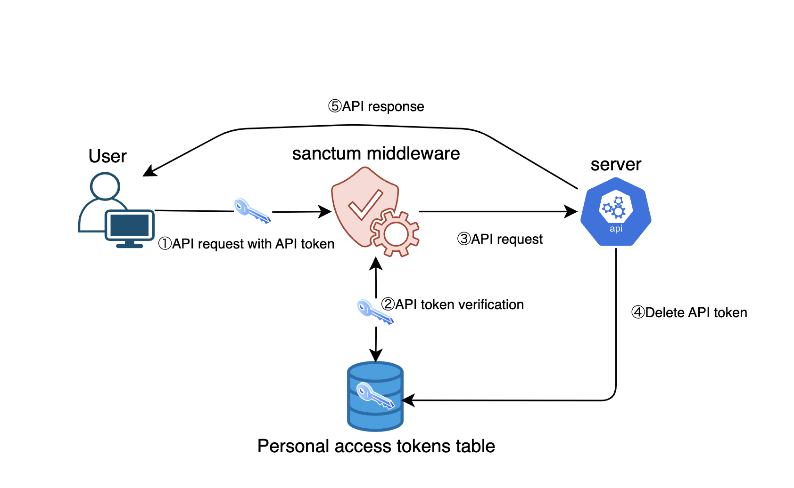

# Laravel Sactum API トークン認証

## 導入

この記事では、API トークン認証に関して図を用いて分かりやすく説明していきます。
API トークン認証の仕組みをざっくりと理解した上で、Laravel Sanctum を使った API トークン認証の仕組みをコードベースで解説していきます。

-   API トークン認証の仕組み
-   Laravel Sanctum のインストール方法
-   ユーザ登録・ログイン時の API トークン生成
-   API トークン認証によるアクセス制限・リソースの所有権の検証
-   ログアウト時の API トークン削除

## API トークン認証の仕組み


#### **1. ユーザーの新規登録・ログインリクエスト**

-   クライアントがユーザーのログイン情報（例：メールアドレス、パスワード）をサーバーに送信する。

#### **2. ユーザーの認証**

-   Auth サーバーは受信したログイン情報を検証し、ユーザーが存在し、パスワードが正しいかを確認する。

#### **3.  トークンの生成**

-   ユーザーがログインに成功すると、Auth サーバーはそのユーザーに対して API トークンを生成し渡す。
    また、生成された API トークンは personal_access_tokens テーブルに保存される。

#### **4. API リクエスト**

-   クライアントは、API リクエストをリソースサーバーに送信する際に、生成された API トークンを`Authorization`ヘッダーに`Bearer`トークンとして付加する。

#### **5.  トークンの検証**

-   リソースサーバーは、受信した API リクエストの`Authorization`ヘッダーに含まれる API トークンを検証する。API トークンが有効であれば、API リクエストは実行される。

#### **6. API レスポンス**

-   API トークンが有効だった場合、ユーザーは認証が必要なエンドポイントにアクセス可能となり、API レスポンスを受け取る。

### 認証サーバーとリソースサーバー

#### **認証サーバー**

**役割**:

-   ユーザーの認証情報（例：ユーザー名、パスワード）を検証する。
-   認証が成功した場合、API トークンを生成してクライアントに返す。

#### **リソースサーバー**

**役割**:

-   クライアントからのリクエストを受け取り、`Authorization`ヘッダーに含まれる API トークンを検証する。
-   トークンが有効であれば、リクエストを処理し、保護されたリソースにアクセスさせる。

## Laravel Sanctum のインストール

```jsx
sail php artisan install:api
```

これにより laravel プロジェクト配下に、api.php や、API トークン認証に必要なテーブル作成用の migration ファイルが生成される。

次に migration を実行する。

```jsx
sail artisan migrate
```

`personal_access_tokens`テーブルが作成される。

```bash
2024_10_23_231407_create_personal_access_tokens_table ......... 3.84ms DONE
```

## ユーザ登録・ログイン時の API トークンの生成



#### サンプルコード

api.php

```php
Route::post('/register', [AuthController::class, 'register']);
```

AuthController.php

```php
public function register(Request $request)
{
    $fields = $request->validate([
        'name' => 'required|max:255',
        'email' => 'required|email|unique:users',
        'password' => 'required|confirmed'
    ]);

    $user = User::create($fields);

    $token = $user->createToken($request->name);

    return [
        'user' => $user,
        'token' => $token->plainTextToken
    ];
}
```

### ユーザ登録

1. ユーザー新規登録
2. 新しいユーザーが users テーブルに保存される
3. API トークンが生成される（`createToken`）
4. 生成された API トークンとユーザー情報は `personal_access_tokens` テーブルに保存される。
   API トークンがユーザーに渡される。

#### サンプルコード

api.php

```php
*Route*::post('/login', [*AuthController*::class, 'login']);
```

AuthController.php

```php
public function login(Request $request)
{
    $request->validate([
        'email' => 'required|email|exists:users',
        'password' => 'required'
    ]);

    $user = User::where('email', $request->email)->first();

    if (!$user || !Hash::check($request->password, $user->password)) {
        return [
            'message' => "User doesn't exist or password doesn't match."
        ];
    }

    $token = $user->createToken($user->name);

    return [
        'user' => $user,
        'token' => $token->plainTextToken
    ];
}
```

### ユーザログイン

1. ユーザーログイン
2. ユーザーが users テーブルに存在するか検証
3. ログイン成功したら API トークンが生成される（`createToken`）
4. 生成された API トークンとユーザー情報は `personal_access_tokens` テーブルに保存される。
   API トークンがユーザーに渡される。
   ※ユーザーがログインするたびに新しい API トークンが生成される。

### API トークンの生成

Postman で下記条件で API リクエストを送信しレスポンスを確認。



リクエストボディにログイン情報を入力し、ログイン用の API エンドポイントにアクセスすると、API トークンが生成される。


personal_access_tokens テーブルを確認すると、ログインしたユーザー名と token が保存されていることが確認できる。
※API レスポンスの token と personal_access_tokens テーブルの token の値が違うのは、DB に保存されるときにハッシュ化されているからである。

## API トークン認証



1. ユーザーは API リクエスト時に Authorization ヘッダーに生成された API Token を含め API リクエストを送信
2. `auth:sanctum`ミドルウェアがリクエストから受け取った API トークンと personal_access_tokens テーブルに保存されている API トークンを照合
3. API トークンの認証に成功したらリソースサーバーが API リクエストを処理する
4. 認証されたユーザーは投稿の更新・削除が可能に
5. リソースサーバーから API レスポンスが送信される

### 投稿機能にアクセス制限をつける

ユーザーに紐づく投稿の CRUD 処理を用意した。

[サンプルコード: PostController.php](https://github.com/Izushi/laravel-sanctum/blob/main/app/Http/Controllers/PostController.php)

Laravel Sanctum を使用して、ユーザーに紐づく投稿の作成・編集・削除の権限はログイン状態ユーザーのみ操作できるようにアクセス制限をかける。
実装をもとに API トークン認証が正しく行われるかを確認する。

### アクセス制限する基準

#### ユーザ用 API

-   **index, show**
    一般的に公開されている情報を提供するアクションに関しては、ユーザーエクスペリエンスと SEO を考慮し API トークン認証をしない
-   **store, update, delete**
    なりすましなどの不正アクセスの防止、データの整合性の維持

#### 管理者用 API

-   **index, show, store, update, delete**
    セキュリティ強化のため公開する必要がない情報や操作を含む場合は、コントローラーのすべてのアクションにユーザー認証を付けることが推奨される

### 実装方法

下記のようにルーティングファイルに記述することで、apiResource で設定した posts の全エンドポイントに対してアクセス制限をつけることもできる。

```php
Route::apiResource('posts', PostController::class)->middleware('auth:sanctum');
```

```php
GET|HEAD        api/posts ............ posts.index › PostController@index
POST            api/posts ............ posts.store › PostController@store
GET|HEAD        api/posts/{post} ..... posts.show › PostController@show
PUT|PATCH       api/posts/{post} ..... posts.update › PostController@update
DELETE          api/posts/{post} ..... posts.destroy › PostController@destroy
```

しかし今回は、PostController の store, update, delete アクションのみに対して API トークン認証の設定をしてアクセス制限したいので
PostController にコンストラクタメソッドを作成し、その中で index, show アクション以外に対して`auth:sanctum`ミドルウェアを使用して API トークン認証を行う。

```php
class PostController extends Controller
{
   public function __construct()
    {
        $this->middleware('auth:sanctum')->except(['index', 'show']);
    }
    ...
}
```

上記によって、投稿の作成、更新、削除時にはユーザー側からトークンをリクエストに含める必要がある。

試しに投稿作成 API に対して、Authorization に Token を含めずリクエストを送信すると、401 エラーとともに”Unauthenticated”というエラーメッセージが返却され投稿作成に失敗する。



そこで、Authorization ヘッダーにログイン時に生成された Token を含めリクエストを送信すると、正常にデータが作成される。



投稿の更新、削除の API でも同様に Authorization ヘッダーに Token を含めリクエストを送信することが求められる。

### 投稿の所有権の検証

API トークン認証によりユーザのアクセス制限は実装できた。しかしまだ問題がある。
現在の状態だと、最低限 API リクエストを送る際にトークンを一緒に送れば、他人の投稿も更新・削除できてしまう。
ユーザーに投稿の所有権があることを検証する過程を追加する。


1. ユーザーは API リクエスト時に Authorization ヘッダーに生成された API Token を含め API リクエストを送信
2. `auth:sanctum`ミドルウェアがリクエストから受け取った API トークンと personal_access_tokens テーブルに保存されている API トークンを照合
3. `auth:sanctum`ミドルウェアが API トークンに紐づくユーザーを取得し、そのユーザーに対象の投稿の所有権があるかを確認
4. API トークンの認証に成功かつ、ユーザーに対象ポストの所有権がある場合、リソースサーバーが API リクエストを処理する
5. 投稿の更新・削除が可能に
6. リソースサーバーから API レスポンスが送信される

### 実装方法

Laravel のポリシーファイルに認可ロジックを記述し、投稿の所有者以外は更新・削除できないように制限をかける。

PostController.php

```php
<?php
use Illuminate\Support\Facades\Gate;

public function update(Request $request, Post $post)
{
    Gate::authorize('modify', $post);

    $fields = $request->validate([
        'title' => 'required|max:255',
        'body' => 'required'
    ]);

    $post->update($fields);

    return response()->json($post, 200);
}

public function destroy(Post $post)
{
    Gate::authorize('modify', $post);

    $post->delete();

    return response()->json(['message' => 'Post deleted'], 200);
}
```

-   **リクエストの受信**
    -   クライアントが API リクエストを送信し、`Authorization`ヘッダーに API トークンを含める。
-   **トークンの検証**
    -   update, delete アクションではサーバーが API リクエストの Authorization ヘッダーから API トークンを抽出し、`auth:sanctum`ミドルウェアによってリクエストから受け取った API トークンと`personal_access_tokens`テーブルに保存されている API トークンが一致しているか検証される
-   **ユーザーの特定**
    -   トークンが有効であれば、トークンに関連付けられたユーザーが特定される。このユーザーは、`$request->user()`メソッドを使用して取得できる。
-   **ポリシーの呼び出し**
    -   `Gate::authorize`メソッドは、現在認証されているユーザーと指定されたリソース（今回は Post オブジェクト）を引数としてポリシーのメソッドに渡す。

PostPolicy.php

```php
<?php

namespace App\Policies;

use App\Models\Post;
use App\Models\User;
use Illuminate\Auth\Access\Response;

class PostPolicy
{
    /**
     * Determine whether the user can modify the post.
     */
    public function modify(User $user, Post $post): Response
    {
        return $user->id === $post->user_id
            ? Response::allow()
            : Response::deny('You do not own this post.');
    }
}
```

**`modify`メソッド**:

-   **引数**:
    -   `$user`: 現在認証されているユーザーのインスタンス。
    -   `$post`: 認可を確認する対象の`Post`モデルのインスタンス。
-   **戻り値**:
    -   `Response::allow()`: ユーザーがアクションを実行する権限がある場合。
    -   `Response::deny('You do not own this post.')`: ユーザーがアクションを実行する権限がない場合。
-   **ロジック**:
    -   現在認証されているユーザーが、指定された投稿の所有者であるかどうかを確認する。所有者であれば許可し、そうでなければ拒否する。

#### 他のユーザーの投稿の更新



1. Postman で、あるユーザーの投稿の id をパスパラメータに指定する
2. この投稿を所有していないユーザーの token を Authorization ヘッダーに含める
3. アクセスすると、403 エラーで投稿の所有者でない旨のエラーメッセージが返される

## ログアウト



### ログアウトの流れ

1. ユーザーは Authorization ヘッダーに API Token を含めログアウトリクエストを送信
2. `auth:sanctum`ミドルウェアがリクエストから受け取った API トークンと personal_access_tokens テーブルに保存されている API トークンを照合
3. API トークンの認証に成功したらリソースサーバーが API リクエストを処理する
4. 認証されたユーザーの API トークンを personal_access_tokens テーブルから削除
5. リソースサーバーからレスポンスが送信される

### 実装方法

api.php

```php
Route::post('/logout', [AuthController::class, 'logout'])->middleware('auth:sanctum');
```

ログアウトのルーティングには`auth::sanctum`ミドルウェアを適用し、API トークン認証を設定する。

AuthController.php

```php
public function logout(Request $request)
{
    $request->user()->currentAccessToken()->delete();

    return [
        'message' => 'You have been logged out.'
    ];
}
```

サーバーは、現在の API トークンをデータベースから削除する。これにより、トークンは無効になり、再度使用することはできなくなる。
サーバーは、ログアウトが成功したことを示すレスポンスをクライアントに返す。

## まとめ

今回は API トークン認証を図を用いてわかりやすく解説しました。
Laravel Sanctum を活用することで、API トークンを用いたシンプルで安全な認証が実現できます。API トークンを利用することで、クライアントはセッションベースの認証とは異なる柔軟性を持ち、ユーザーごとにアクセス権を付与できます。また、ミドルウェアやポリシーを使用することで、API リクエストの保護、アクセス制限、リソースの所有権の検証なども効率的に行えます。
