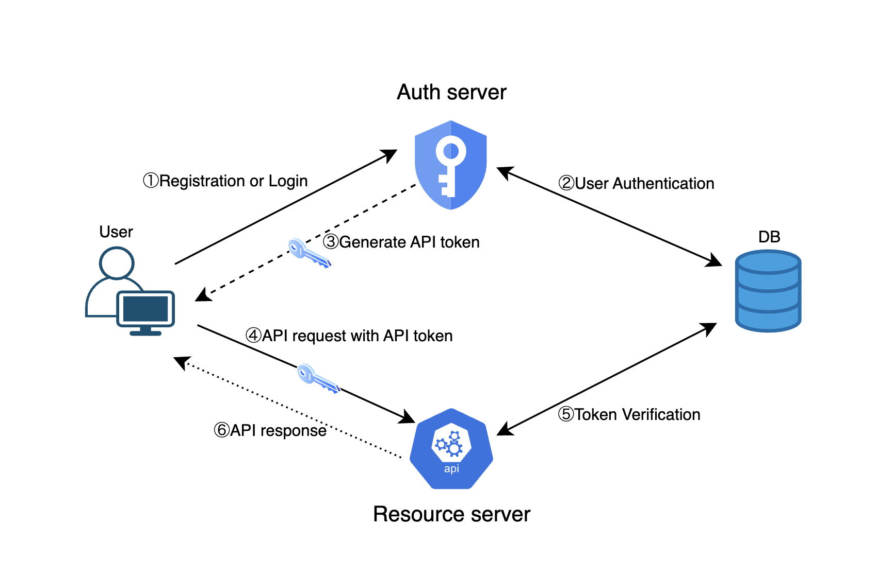
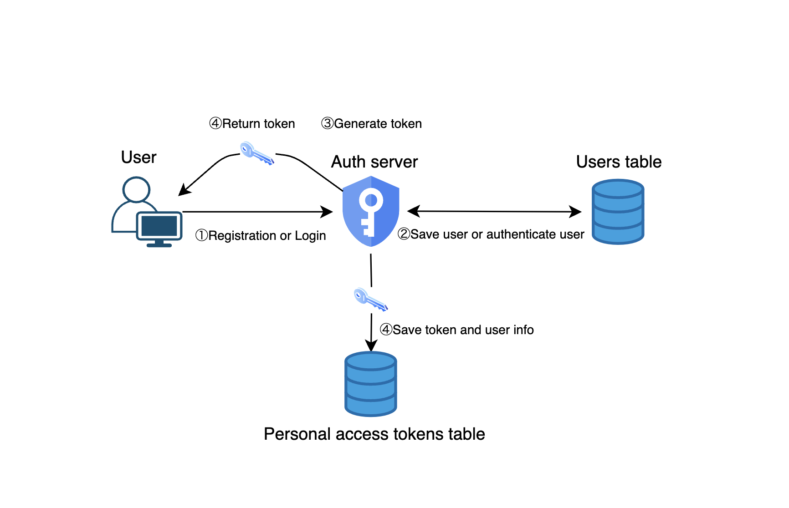
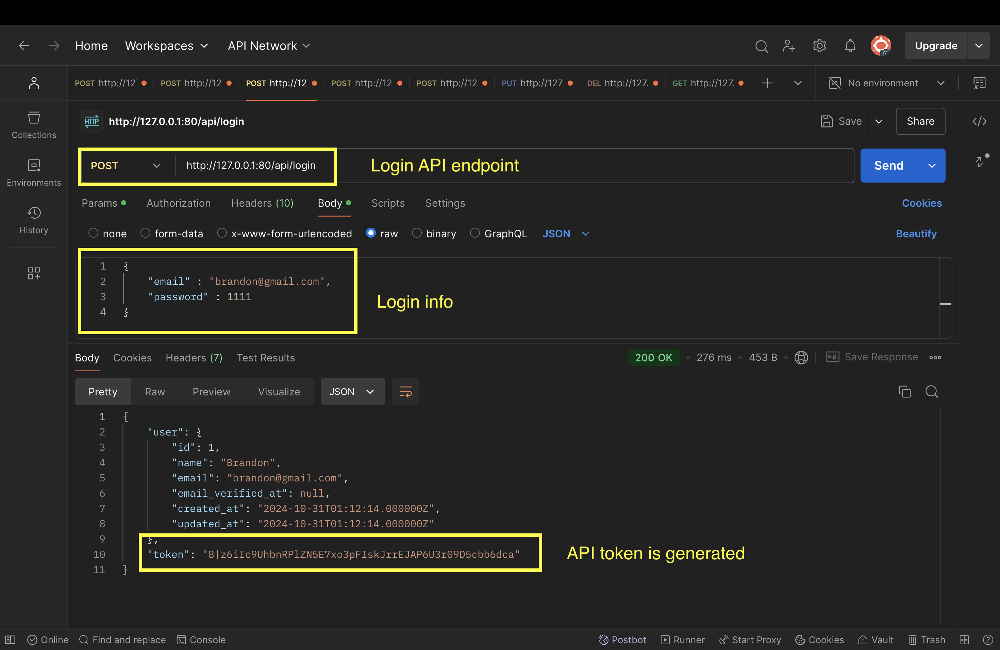
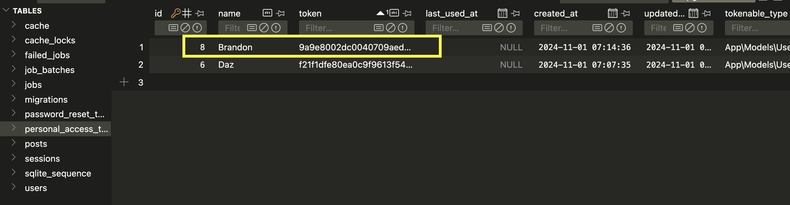
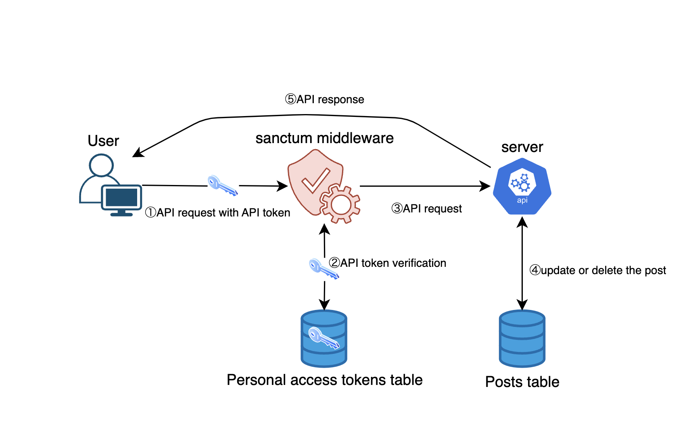
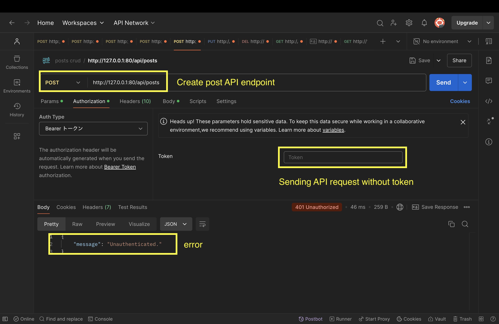
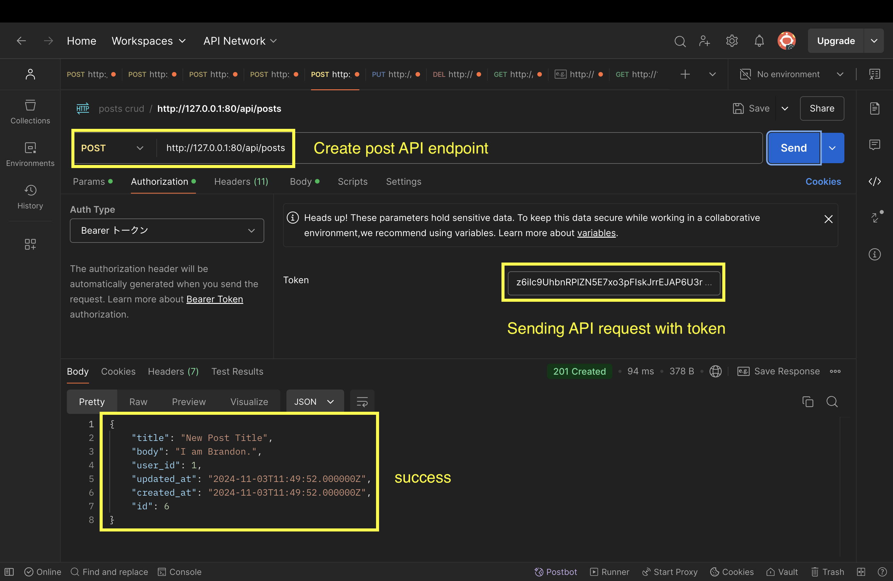
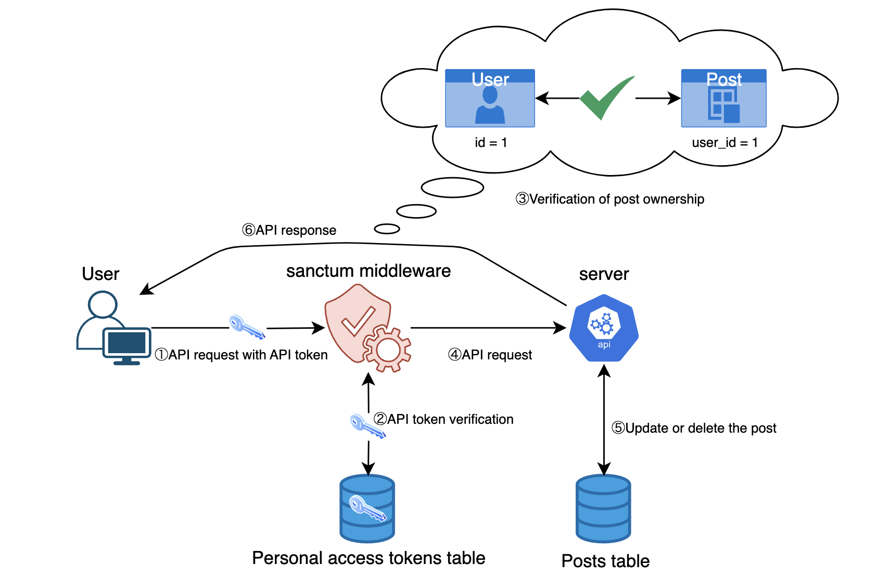
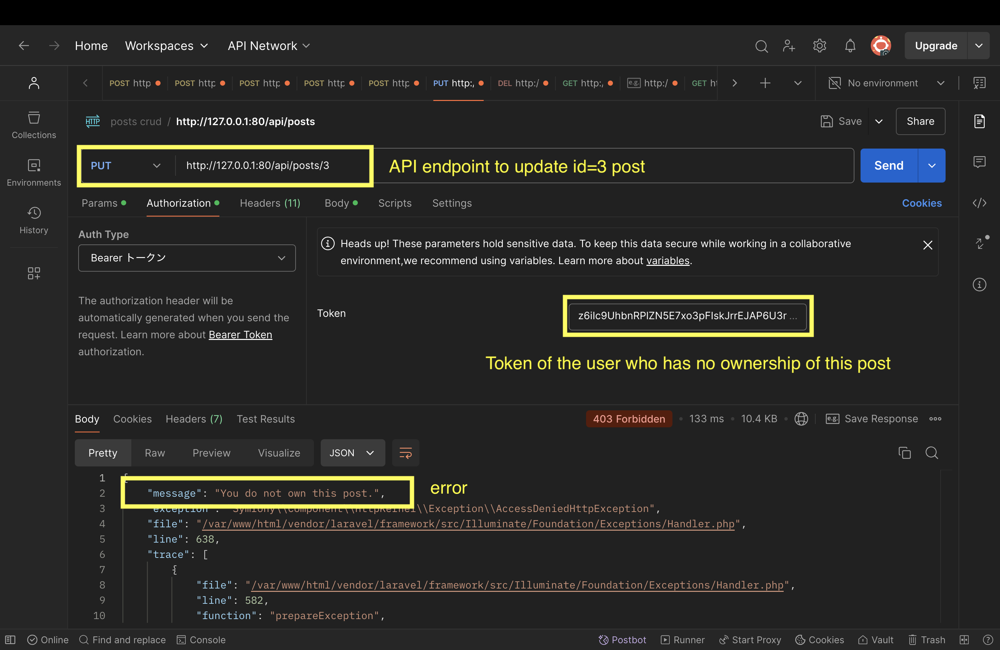
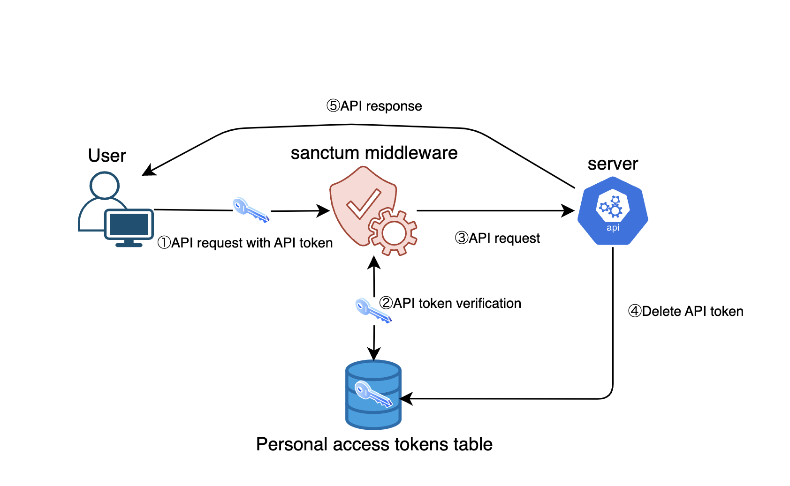

# Laravel Sactum API Token Authentication

## Introduction

In this article, I will explain API token authentication in an easy-to-understand manner using diagrams.
After having a rough understanding of how API token authentication works, I will explain how API token authentication works using Laravel Sanctum in a code-based manner.

By reading this article you will learn the following

-   **How API Token Authentication Works**
-   **How to install Laravel Sanctum**
-   **Generating API Token at User Registration and Login**
-   **API token authentication to restrict access and verify resource ownership**
-   **Deletion of API token on logout**

## How API Token Authentication Works



#### **1. User Registration/Login Request**

Client sends the user’s login information (e.g., email, password) to Auth server.

#### **2. User Authentication**

Auth server verifies the login information to check if the user exists and if the password is correct.

#### **3.  API Token Generation**

Upon successful login, Auth server generates an API token for the user. The generated API token is stored in the `personal_access_tokens` table.

#### **4. API Request**

Client sends API request to Resource server, attaching the generated API token to the `Authorization` header.

#### **5.  API Token Verification**

Resource server verifies API token. If API token is valid, the request is processed.

#### **6. API Response**

Resource server returns API response.

## How to install Laravel Sanctum

```bash
sail php artisan install:api
```

This command generates the `api.php` file and migration files needed for API token authentication under the Laravel project.

Then, execute the migration:

```bash
sail artisan migrate
```

This creates `personal_access_tokens` table.

```bash
2024_10_23_231407_create_personal_access_tokens_table ......... 3.84ms DONE
```

## Generating API Token at User Registration and Login



#### Sample Code

api.php

```php
Route::post('/register', [AuthController::class, 'register']);
```

AuthController.php

```php
public function register(Request $request)
{
    $fields = $request->validate([
        'name' => 'required|max:255',
        'email' => 'required|email|unique:users',
        'password' => 'required|confirmed'
    ]);

    $user = User::create($fields);

    $token = $user->createToken($request->name);

    return [
        'user' => $user,
        'token' => $token->plainTextToken
    ];
}
```

### User Registration

1. User registration.
2. The new user is saved in the `users` table.
3. An API token is generated. (`createToken`)
4. The generated API token and user information are stored in the `personal_access_tokens` table, and API token is provided to the user.

#### Sample Code

api.php

```php
*Route*::post('/login', [*AuthController*::class, 'login']);
```

AuthController.php

```php
public function login(Request $request)
{
    $request->validate([
        'email' => 'required|email|exists:users',
        'password' => 'required'
    ]);

    $user = User::where('email', $request->email)->first();

    if (!$user || !Hash::check($request->password, $user->password)) {
        return [
            'message' => "User doesn't exist or password doesn't match."
        ];
    }

    $token = $user->createToken($user->name);

    return [
        'user' => $user,
        'token' => $token->plainTextToken
    ];
}
```

### User Login

1. User login.
2. Verifies if the user exists in the `users` table.
3. API token is generated after successful login. (`createToken`)
4. The generated API token and user information are stored in the personal_access_tokens table, and API token is provided to the user.

\*Note:A new API token is generated each time a user logs in.

### API Token Generation

Using Postman, send an API request with the following conditions to check the response.



Upon successful login, an API token is generated.



You can check `personal_access_tokens` table to confirm that the logged-in user’s name and API token are saved.
\*Note: The token in API response differs from the token in the `personal_access_tokens` table because it is hashed when stored in the database.

## API Token Authentication



1. User sends API request and includes API token in `Authorization` header.
2. `auth:sanctum` middleware matches API token received from API request against API token stored in personal_access_tokens table.
3. If API token is successfully authenticated, Resource server processes API request.
4. The authenticated user can update or delete posts.
5. Resource server returns API response.

### Restrict access to post functions

The following is the sample code of CRUD process for posts associated with a user.

[Sample code: PostController.php](https://github.com/Izushi/laravel-sanctum/blob/main/app/Http/Controllers/PostController.php)

Using Laravel Sanctum, restrict access so that only logged-in users can create, edit, and delete posts associated with a user.
Send actual API request to verify that API Token Authentication is performed correctly.

### Access Control Standards

#### User APIs

-   **index, show**
    These actions provide generally public information and do not require API token authentication for better user experience and SEO.
-   **store, update, delete**
    To prevent unauthorized access and maintain data integrity, API token authentication is required.

#### Admin APIs

-   **index, show, store, update, delete**
    For enhanced security, APIs that do not need to be public should be secured by requiring user authentication for all controller actions.

### Coding

It is also possible to restrict access to all endpoints of posts set in apiResource by writing the following in the routing file.

api.php

```php
Route::apiResource('posts', PostController::class)->middleware('auth:sanctum');
```

```php
GET|HEAD        api/posts ............ posts.index › PostController@index
POST            api/posts ............ posts.store › PostController@store
GET|HEAD        api/posts/{post} ..... posts.show › PostController@show
PUT|PATCH       api/posts/{post} ..... posts.update › PostController@update
DELETE          api/posts/{post} ..... posts.destroy › PostController@destroy
```

In this case, we want to set API token authentication only for the store, update, and delete actions in the PostController. To do this, create a constructor method in PostController and apply the `auth:sanctum` middleware to all actions except index and show.

PostController.php

```php
class PostController extends Controller
{
   public function __construct()
    {
        $this->middleware('auth:sanctum')->except(['index', 'show']);
    }
    ...
}
```

Now, users must include the token in the request when creating, updating, or deleting a post.

Testing this setup, if you send a request without the Authorization token for creating a post, a 401 error with an `"Unauthenticated"` message is returned, and the post creation fails.



If the Authorization token is included, the data is created successfully.



Similarly, the API for updating and deleting posts requires that the request be sent with the Token in the Authorization header.

### Post Ownership Verification

User access restrictions have been implemented with API Token Authentication.
However, there is still a problem.
In its current state, authenticated users can update or delete another user's posts.
Add a process to verify that the user has ownership of the post.



1. User sends API request and includes API token in `Authorization` header.
2. `auth:sanctum` middleware matches API token received from API request against API token stored in the personal_access_tokens table.
3. `auth:sanctum` middleware gets the user associated with API token and checks if this user has ownership of the target post.
4. If API token is successfully authenticated and the user has ownership of the target post, Resource server will process API request.
5. The authenticated user with ownership of posts can update and delete posts.
6. Resource server returns API response.

### Coding

Write authorization logic in the Laravel policy file so that only the users having the ownership of the posts can update and delete the posts.

PostController.php

```php
<?php
use Illuminate\Support\Facades\Gate;

public function update(Request $request, Post $post)
{
    Gate::authorize('modify', $post);

    $fields = $request->validate([
        'title' => 'required|max:255',
        'body' => 'required'
    ]);

    $post->update($fields);

    return response()->json($post, 200);
}

public function destroy(Post $post)
{
    Gate::authorize('modify', $post);

    $post->delete();

    return response()->json(['message' => 'Post deleted'], 200);
}
```

-   **Receiving a request**
    -   User sends API request and includes API token in the `Authorization` header.
-   **Verification of Token**
    -   Resource server gets API token from the Authorization header of API request.
        And then verifies that API token received from the request matches API token stored in `personal_access_tokens` table.
-   **User Identification**
    -   If the token is valid, the user associated with the token is identified.
        We can get the identified user with `$request->user()` method.
-   **Calling a policy**
    `Gate::authorize` method passes the authenticated user and the resource objects as arguments to the policy's methods.

PostPolicy.php

```php
<?php

namespace App\Policies;

use App\Models\Post;
use App\Models\User;
use Illuminate\Auth\Access\Response;

class PostPolicy
{
    public function modify(User $user, Post $post): Response
    {
        return $user->id === $post->user_id
            ? Response::allow()
            : Response::deny('You do not own this post.');
    }
}
```

**`modify`method**:

-   **Arguments**:
    -   `$user`: Instance of the currently authenticated user.
    -   `$post`: An instance of the `Post` model.
-   **Logic**:
    -   Check whether the currently authenticated user has the ownership of the specified post.

#### Updating other users' post



1. Set the post id as a path parameter to post update API endpoint.
2. Include the token of a user who does not own this post in the Authorization header.
3. Returns a 403 error message stating that you are not the owner of the post.

## Deletion of API token on logout



### Logout Flow

1. User sends API request and includes API token in `Authorization` header
2. `auth:sanctum` middleware matches API token received from API request against API token stored in the personal_access_tokens table.
3. If API token is successfully authenticated, Resource server processes API request.
4. Delete API token of the authenticated user from the `personal_access_tokens` table.
5. Resource server returns API response.

### Coding

api.php

```php
Route::post('/logout', [AuthController::class, 'logout'])->middleware('auth:sanctum');
```

Apply the `auth::sanctum` middleware for logout routing and set API Token Authentication.

AuthController.php

```php
public function logout(Request $request)
{
    $request->user()->currentAccessToken()->delete();

    return [
        'message' => 'You have been logged out.'
    ];
}
```

The server will delete the current API token from the database. This makes the token invalid and cannot be used again.
The server returns a response to the client indicating that the logout was successful.

## Summary

In this article, API token authentication was explained in an easy-to-understand manner using diagrams.
By leveraging Laravel Sanctum, simple and secure authentication can be achieved using API tokens, which allow clients to grant access rights to individual users with a flexibility that differs from session-based authentication. Using middleware and policies, API requests can also be efficiently protected, access restricted, and resource ownership verified.
